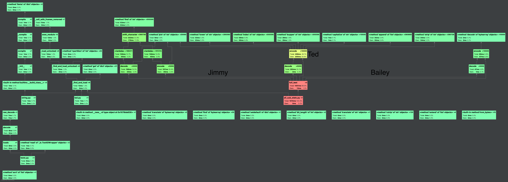

# All Submissions
## Statistics
### Speed
```
bailey: 0.09148097038269043 ms
   ted: 0.18241405487060547 ms
 jimmy: 0.23460626602172852 ms
```
### Character Count
```
bailey: 369 
   ted: 515
 jimmy: 637
```
### Call Graph
This is generated using PyCharm. It outlines the various functions each function calls.
Can definitely see why Bailey's was the fastest! I don't even fully understand how to interpret
all the data here, but what I do understand I find super interesting.



## Code
### Bailey
```python
def encode(plaintext, shift):
    b = bytearray(plaintext, 'utf-8')
    for i in range(len(plaintext)):
        c = b[i]
        if c > 64 and c < 91:
            b[i] = (c - 65 + shift) % 26 + 65
        elif c > 96 and c < 123:
            b[i] = (c - 97 + shift) % 26 + 97
    return b.decode()

def decode(cypher_text, shift):
    return encode(cypher_text, -shift)
```

### Ted
```python
import string


def encode(plaintext, shift):
    alpha = string.ascii_letters
    data = []

    for i in plaintext:
        if i.strip() and i in alpha:
            if i.isupper():
                data.append(alpha[(alpha.index(i) + shift) % 52].capitalize())
            else:
                data.append(alpha[(alpha.index(i) + shift) % 52].lower())
        else:
            data.append(i)

    cypher = ''.join(data)
    return cypher


def decode(cypher_text, shift):
    return encode(cypher_text, shift*-1)
```

### Jimmy
```python
def shift_character(char, shift):
    upper = 'ABCDEFGHIJKLMNOPQRSTUVWXYZ'
    lower = 'abcdefghijklmnopqrstuvwxyz'
    if char not in upper and char not in lower:
        return char
    for collection in [upper, lower]:
        if char in collection:
            index = collection.find(char) + shift
            return collection[index % 26]


def encode(plaintext, shift):
    cypher_text = list(map(lambda char: shift_character(char, shift), plaintext))
    return ''.join(cypher_text)


def decode(cypher_text, shift):
    plaintext = list(map(lambda char: shift_character(char, -shift), cypher_text))
    return ''.join(plaintext)
```